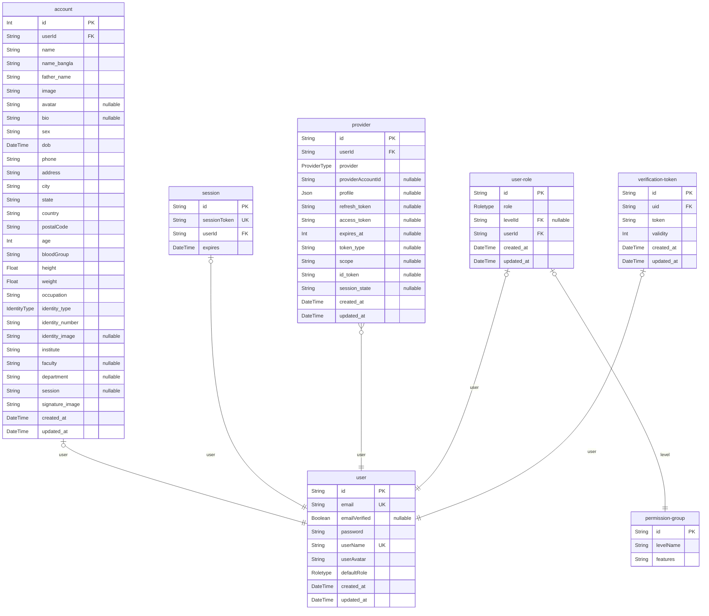

# HSTU Karate Dojo
> Generated by [`prisma-markdown`](https://github.com/samchon/prisma-markdown)

- [default](#default)

## default

### `account`

**Properties**
  - `id`: 
  - `userId`: 
  - `name`: 
  - `name_bangla`: 
  - `father_name`: 
  - `image`: 
  - `avatar`: 
  - `bio`: 
  - `sex`: 
  - `dob`: 
  - `phone`: 
  - `address`: 
  - `city`: 
  - `state`: 
  - `country`: 
  - `postalCode`: 
  - `age`: 
  - `bloodGroup`: 
  - `height`: 
  - `weight`: 
  - `occupation`: 
  - `identity_type`: 
  - `identity_number`: 
  - `identity_image`: 
  - `institute`: 
  - `faculty`: 
  - `department`: 
  - `session`: 
  - `signature_image`: 
  - `created_at`: 
  - `updated_at`: 

### `session`

**Properties**
  - `id`: 
  - `sessionToken`: 
  - `userId`: 
  - `expires`: 

### `user`

**Properties**
  - `id`: 
  - `email`: 
  - `emailVerified`: 
  - `password`: 
  - `userName`: 
  - `userAvatar`: 
  - `defaultRole`: 
  - `created_at`: 
  - `updated_at`: 

### `provider`

**Properties**
  - `id`: 
  - `userId`: 
  - `provider`: 
  - `providerAccountId`: 
  - `profile`: 
  - `refresh_token`: 
  - `access_token`: 
  - `expires_at`: 
  - `token_type`: 
  - `scope`: 
  - `id_token`: 
  - `session_state`: 
  - `created_at`: 
  - `updated_at`: 

### `user-role`

**Properties**
  - `id`: 
  - `role`: 
  - `levelId`: 
  - `userId`: 
  - `created_at`: 
  - `updated_at`: 

### `permission-group`

**Properties**
  - `id`: 
  - `levelName`: 
  - `features`: 

### `verification-token`

**Properties**
  - `id`: 
  - `uid`: 
  - `token`: 
  - `validity`: 
  - `created_at`: 
  - `updated_at`: 