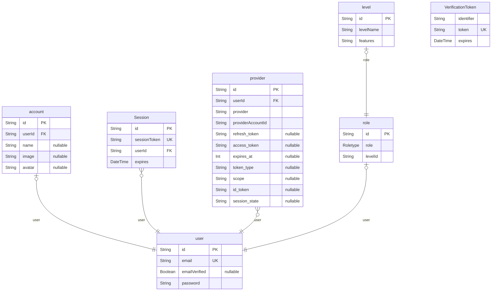

# HSTU Karate Dojo
> Generated by [`prisma-markdown`](https://github.com/samchon/prisma-markdown)

- [default](#default)

## default

### `account`

**Properties**
  - `id`: 
  - `userId`: 
  - `name`: 
  - `image`: 
  - `avatar`: 

### `Session`

**Properties**
  - `id`: 
  - `sessionToken`: 
  - `userId`: 
  - `expires`: 

### `user`

**Properties**
  - `id`: 
  - `email`: 
  - `emailVerified`: 
  - `password`: 

### `provider`

**Properties**
  - `id`: 
  - `userId`: 
  - `provider`: 
  - `providerAccountId`: 
  - `refresh_token`: 
  - `access_token`: 
  - `expires_at`: 
  - `token_type`: 
  - `scope`: 
  - `id_token`: 
  - `session_state`: 

### `role`

**Properties**
  - `id`: 
  - `role`: 
  - `levelId`: 

### `level`

**Properties**
  - `id`: 
  - `levelName`: 
  - `features`: 

### `VerificationToken`

**Properties**
  - `identifier`: 
  - `token`: 
  - `expires`: 